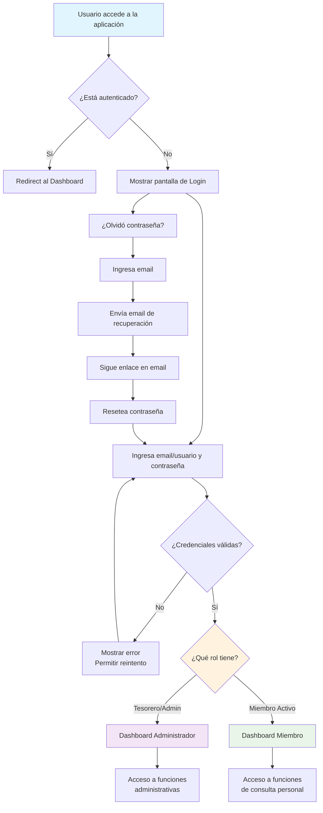
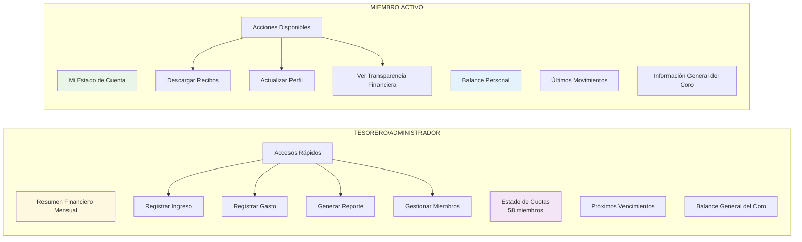
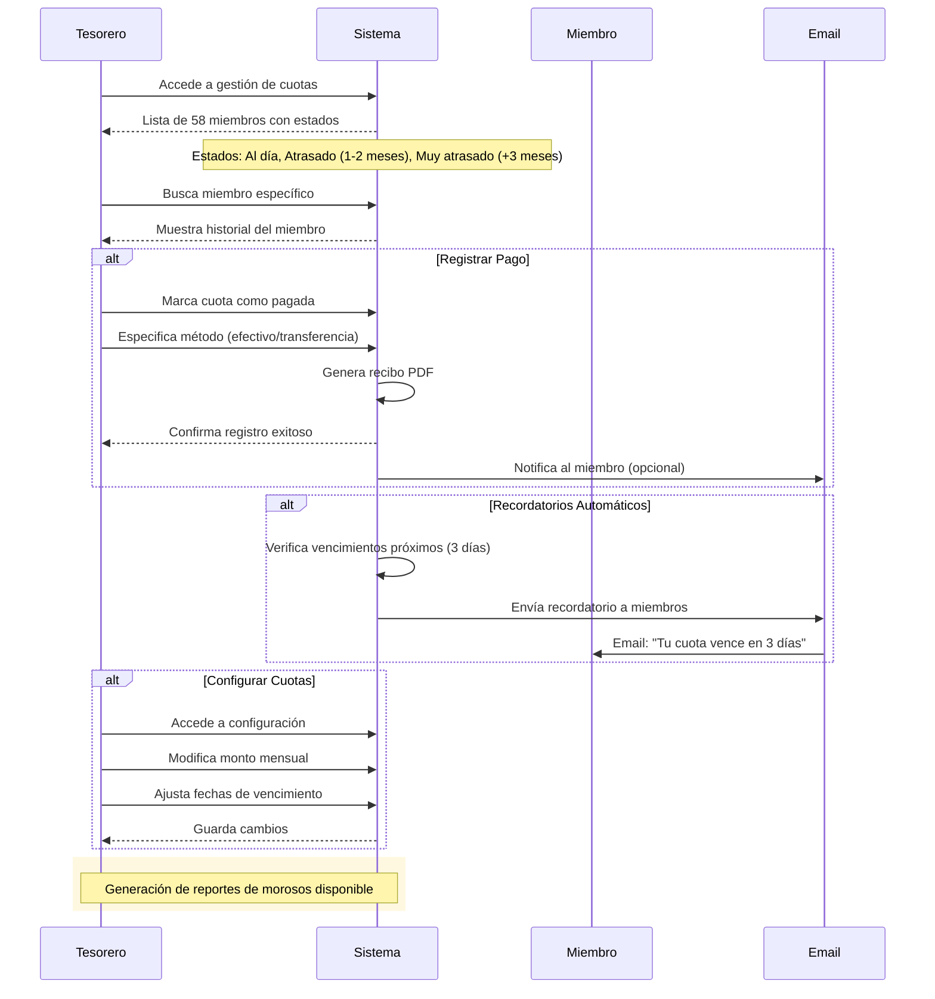
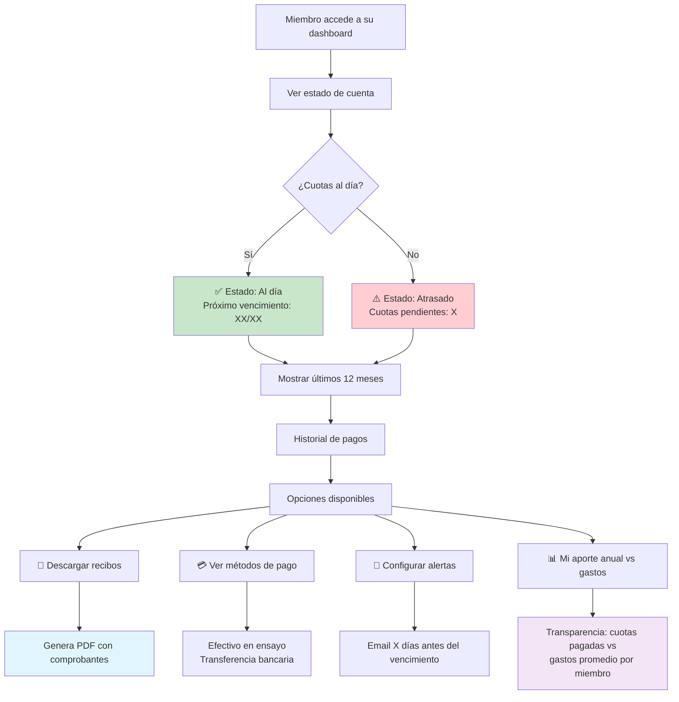
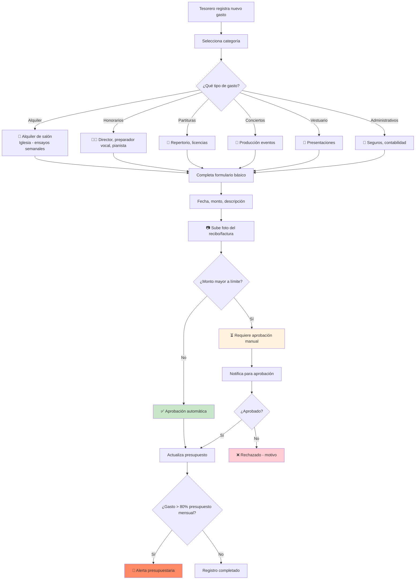
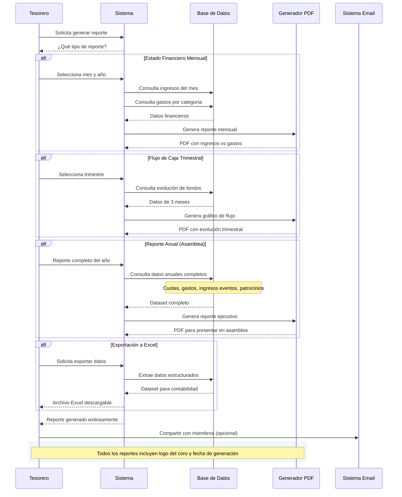
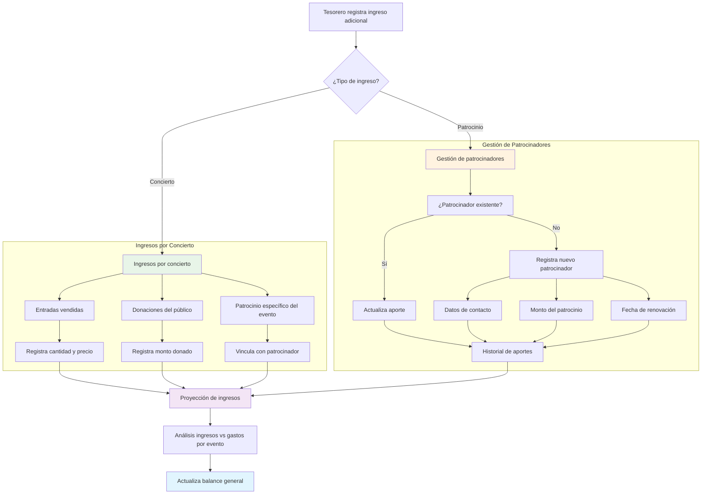
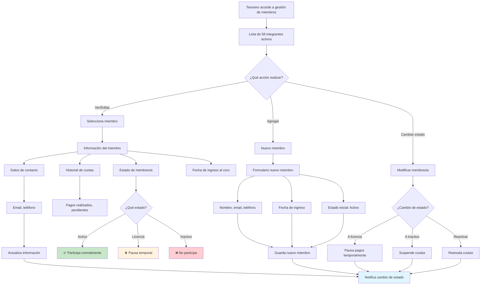
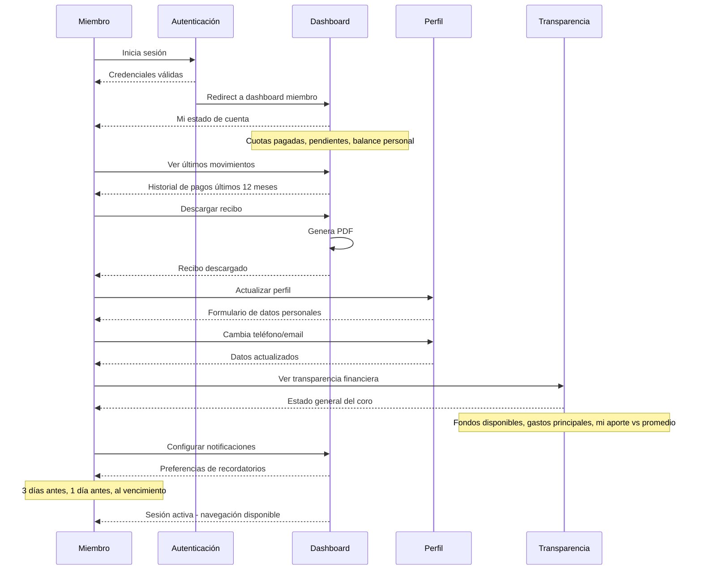

# Diagramas de Flujos de Usuario - Coro Polyphonia

Este documento contiene los diagramas Mermaid que representan los flujos principales de usuario para la aplicación de gestión financiera del Coro Polyphonia. Estos diagramas sirven como referencia visual para desarrolladores.

## Índice de Diagramas

1. [Flujo de Autenticación](#1-flujo-de-autenticación)
2. [Dashboard Principal - Roles](#2-dashboard-principal---roles)
3. [Gestión de Cuotas (Tesorero)](#3-gestión-de-cuotas-tesorero)
4. [Consulta de Estado Personal (Miembro)](#4-consulta-de-estado-personal-miembro)
5. [Registro de Gastos del Coro](#5-registro-de-gastos-del-coro)
6. [Generación de Reportes Financieros](#6-generación-de-reportes-financieros)
7. [Flujo de Ingresos Adicionales](#7-flujo-de-ingresos-adicionales)
8. [Gestión de Miembros](#8-gestión-de-miembros)

---

## 1. Flujo de Autenticación

---

## 2. Dashboard Principal - Roles

---

## 3. Gestión de Cuotas (Tesorero)

---

## 4. Consulta de Estado Personal (Miembro)

---

## 5. Registro de Gastos del Coro

---

## 6. Generación de Reportes Financieros

---

## 7. Flujo de Ingresos Adicionales

---

## 8. Gestión de Miembros

---

## Flujo de Usuario Miembro - Navegación Completa

---

## Consideraciones Técnicas para Desarrolladores

### Estados de la Aplicación
- **Cuotas**: `al_dia`, `atrasado_1_mes`, `atrasado_2_meses`, `muy_atrasado`
- **Membresía**: `activo`, `licencia_temporal`, `inactivo`
- **Gastos**: `pendiente_aprobacion`, `aprobado`, `rechazado`
- **Notificaciones**: `programada`, `enviada`, `fallida`

### Flujos Críticos
1. **Respaldo automático**: Datos financieros cada semana
2. **Recordatorios**: 3 días antes del vencimiento de cuotas
3. **Validaciones**: Gastos > presupuesto mensual
4. **Generación PDF**: Recibos y reportes con logo del coro

### Optimizaciones para 58 Usuarios
- Base de datos liviana sin necesidad de escalabilidad compleja
- Interfaz responsive prioritaria (uso en celulares)
- Funcionalidades simplificadas enfocadas en gestión financiera
- Notificaciones por email (no push notifications)

---

*Documentación generada para el proyecto Coro Polyphonia - Sistema de Gestión Financiera*
*Fecha: Diciembre 2024*
