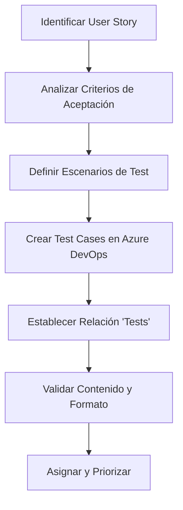

# Consideraciones Técnicas para Creación de Test Cases en Azure DevOps

## Información General
Este documento recopila las consideraciones técnicas esenciales para la creación y gestión de casos de prueba (test cases) en Azure DevOps, incluyendo campos obligatorios, tipos de relaciones, formatos recomendados y mejores prácticas identificadas durante la implementación.

**Fecha de creación:** 6 de junio de 2025  
**Basado en:** Experiencia con US #19676 - Validación de Fortaleza de Password  
**Herramientas utilizadas:** Azure DevOps API, MCP Server, Context7

---

## Campos Obligatorios y Recomendados

### Campos Mínimos Requeridos
| Campo | Tipo | Descripción | Obligatorio |
|-------|------|-------------|-------------|
| `System.Title` | String | Título descriptivo del test case | ✅ Sí |
| `System.WorkItemType` | String | Debe ser "Test Case" | ✅ Sí |
| `System.Description` | HTML | Descripción detallada del caso de prueba | ⚠️ Recomendado |

### Campos Específicos de Test Cases
| Campo | Tipo | Descripción | Uso |
|-------|------|-------------|-----|
| `Microsoft.VSTS.TCM.Steps` | HTML | Pasos de ejecución del test | ✅ Crítico |
| `Microsoft.VSTS.Common.AcceptanceCriteria` | HTML | Criterios de aceptación | ✅ Crítico |
| `System.AreaPath` | String | Área funcional del proyecto | ⚠️ Organización |
| `System.IterationPath` | String | Sprint o iteración | ⚠️ Organización |
| `System.AssignedTo` | Identity | Responsable del test case | ⚠️ Asignación |
| `Microsoft.VSTS.Common.Priority` | Integer | Prioridad (1-4) | ⚠️ Priorización |

### Campos Opcionales pero Útiles
| Campo | Tipo | Descripción | Beneficio |
|-------|------|-------------|-----------|
| `System.Tags` | String | Etiquetas para clasificación | Búsqueda y filtrado |
| `Microsoft.VSTS.TCM.AutomationStatus` | String | Estado de automatización | Gestión de automatización |
| `Microsoft.VSTS.Common.StateChangeDate` | DateTime | Fecha último cambio | Auditoría |

---

## Formato HTML para Contenido

### Template para System.Description
```html
<div>
  <h3>Objetivo del Test Case</h3>
  <p><strong>[Descripción clara del propósito del test]</strong></p>
  
  <h4>Precondiciones</h4>
  <ul>
    <li>Condición previa 1</li>
    <li>Condición previa 2</li>
  </ul>
  
  <h4>Datos de Prueba</h4>
  <ul>
    <li>Dato válido: [ejemplo]</li>
    <li>Dato inválido: [ejemplo]</li>
  </ul>
  
  <hr>
  <blockquote>
    <em>Resultado esperado general: [descripción del comportamiento esperado]</em>
  </blockquote>
</div>
```

### Template para Microsoft.VSTS.TCM.Steps
```html
<div>
  <h4>Pasos de Ejecución</h4>
  <ol>
    <li>
      <strong>Acción:</strong> [Descripción del paso]<br>
      <strong>Datos:</strong> [Datos específicos a usar]<br>
      <strong>Resultado Esperado:</strong> [Qué debe ocurrir]
    </li>
    <li>
      <strong>Acción:</strong> [Siguiente paso]<br>
      <strong>Datos:</strong> [Datos correspondientes]<br>
      <strong>Resultado Esperado:</strong> [Resultado específico]
    </li>
  </ol>
  
  <h5>Validaciones Finales</h5>
  <ul>
    <li>Verificar [aspecto 1]</li>
    <li>Confirmar [aspecto 2]</li>
  </ul>
</div>
```

### Template para Microsoft.VSTS.Common.AcceptanceCriteria
```html
<div>
  <h4>Criterios de Aceptación</h4>
  
  <h5>Escenario Positivo</h5>
  <p><strong>Dado</strong> [contexto inicial]</p>
  <p><strong>Cuando</strong> [acción del usuario]</p>
  <p><strong>Entonces</strong> [resultado esperado]</p>
  
  <h5>Escenarios Negativos</h5>
  <ol>
    <li>
      <strong>Dado</strong> [contexto con datos inválidos]<br>
      <strong>Cuando</strong> [misma acción]<br>
      <strong>Entonces</strong> [comportamiento de error esperado]
    </li>
    <li>
      <strong>Dado</strong> [otro contexto de error]<br>
      <strong>Cuando</strong> [acción correspondiente]<br>
      <strong>Entonces</strong> [manejo de error específico]
    </li>
  </ol>
  
  <hr>
  <p><em><strong>Nota:</strong> Todos los criterios deben cumplirse para considerar el test exitoso.</em></p>
</div>
```

---

## Tipos de Relaciones

### Relaciones Correctas para Test Cases

#### 1. Relación "Tests" / "Tested By"
```bash
# Comando MCP para establecer relación correcta
mcp_azuredevopssh2_manage_work_item_link
- operation: "add"
- sourceWorkItemId: [ID_TEST_CASE]
- targetWorkItemId: [ID_USER_STORY]
- relationType: "Microsoft.VSTS.Common.TestedBy-Reverse"
```

**Características:**
- **Nombre interno:** `Microsoft.VSTS.Common.TestedBy-Reverse`
- **Vista en UI:** Test Case "Tests" User Story
- **Vista inversa:** User Story "Tested By" Test Case
- **Propósito:** Establece que el test case valida la funcionalidad

#### 2. Relaciones a Evitar

##### Relación Parent/Child (Incorrecta)
```bash
# ❌ NO USAR - Relación jerárquica incorrecta
- relationType: "System.LinkTypes.Hierarchy-Forward"
- relationType: "System.LinkTypes.Hierarchy-Reverse"
```

**Problemas identificados:**
- Crea dependencia jerárquica innecesaria
- No refleja la naturaleza de validación del test
- Dificultad para eliminar una vez establecida

### Comandos MCP para Gestión de Relaciones

#### Agregar Relación "Tests"
```json
{
  "operation": "add",
  "sourceWorkItemId": [ID_TEST_CASE],
  "targetWorkItemId": [ID_USER_STORY],
  "relationType": "Microsoft.VSTS.Common.TestedBy-Reverse",
  "comment": "Estableciendo relación de validación test-funcionalidad"
}
```

#### Eliminar Relación Incorrecta
```json
{
  "operation": "remove",
  "sourceWorkItemId": [ID_TEST_CASE],
  "targetWorkItemId": [ID_USER_STORY],
  "relationType": "System.LinkTypes.Hierarchy-Reverse"
}
```

**⚠️ Limitación identificada:** La eliminación de relaciones Parent/Child puede presentar dificultades técnicas y requerir intervención manual en la UI de Azure DevOps.

---

## Convenciones de Nomenclatura

### Título del Test Case
**Formato recomendado:**
```
TC[NNN] - [Funcionalidad] - [Escenario] - [Criterio específico]
```

**Ejemplos:**
- `TC001 - Validación Password - Longitud Mínima - 8 caracteres`
- `TC002 - Validación Password - Caracteres Especiales - Al menos uno requerido`
- `TC003 - Validación Password - Combinación Alfanumérica - Letras y números`

### Identificadores y Referencias
- **Prefijo:** TC seguido de número secuencial con ceros a la izquierda
- **Rango recomendado:** TC001 a TC999 por funcionalidad
- **Agrupación:** Por historia de usuario o feature

---

## Estructura de Contenido Detallada

### Información Esencial por Test Case

#### 1. Descripción (System.Description)
- **Objetivo claro** del test case
- **Precondiciones** necesarias
- **Datos de prueba** específicos
- **Contexto** de la funcionalidad

#### 2. Pasos de Ejecución (Microsoft.VSTS.TCM.Steps)
- **Secuencia numerada** de acciones
- **Datos específicos** para cada paso
- **Resultado esperado** por paso
- **Validaciones intermedias**

#### 3. Criterios de Aceptación (Microsoft.VSTS.Common.AcceptanceCriteria)
- **Escenarios positivos** (happy path)
- **Escenarios negativos** (edge cases)
- **Condiciones de error** y su manejo
- **Criterios de finalización**

### Ejemplo Completo: TC001 - Validación Longitud Mínima

#### System.Description
```html
<div>
  <h3>Objetivo del Test Case</h3>
  <p><strong>Validar que el sistema requiere contraseñas de al menos 8 caracteres para cumplir con la política de seguridad.</strong></p>
  
  <h4>Precondiciones</h4>
  <ul>
    <li>Usuario en pantalla de registro o cambio de contraseña</li>
    <li>Campo de contraseña visible y habilitado</li>
    <li>Validaciones de frontend activas</li>
  </ul>
  
  <h4>Datos de Prueba</h4>
  <ul>
    <li>Contraseña válida: "MiPass123!"</li>
    <li>Contraseña inválida: "123"</li>
    <li>Contraseña límite: "12345678"</li>
  </ul>
  
  <hr>
  <blockquote>
    <em>Resultado esperado general: El sistema debe rechazar contraseñas menores a 8 caracteres y mostrar mensaje explicativo.</em>
  </blockquote>
</div>
```

#### Microsoft.VSTS.TCM.Steps
```html
<div>
  <h4>Pasos de Ejecución</h4>
  <ol>
    <li>
      <strong>Acción:</strong> Ingresar contraseña de 3 caracteres<br>
      <strong>Datos:</strong> "123"<br>
      <strong>Resultado Esperado:</strong> Campo marcado como inválido, mensaje de error visible
    </li>
    <li>
      <strong>Acción:</strong> Ingresar contraseña de exactamente 8 caracteres<br>
      <strong>Datos:</strong> "12345678"<br>
      <strong>Resultado Esperado:</strong> Campo aceptado como válido, sin mensaje de error
    </li>
    <li>
      <strong>Acción:</strong> Ingresar contraseña mayor a 8 caracteres<br>
      <strong>Datos:</strong> "MiPassword123!"<br>
      <strong>Resultado Esperado:</strong> Campo aceptado como válido
    </li>
  </ol>
  
  <h5>Validaciones Finales</h5>
  <ul>
    <li>Verificar consistencia del mensaje de error</li>
    <li>Confirmar que la validación ocurre en tiempo real</li>
  </ul>
</div>
```

---

## Mejores Prácticas de Implementación

### 1. Proceso de Creación


### 2. Validación de Calidad
**Checklist antes de finalizar:**
- [ ] Título descriptivo y único
- [ ] Descripción con objetivo claro
- [ ] Pasos numerados y específicos
- [ ] Criterios de aceptación completos
- [ ] Relación "Tests" establecida correctamente
- [ ] Datos de prueba específicos incluidos
- [ ] Resultados esperados definidos
- [ ] Formato HTML válido

### 3. Organización y Mantenimiento
- **Agrupación:** Por funcionalidad o historia de usuario
- **Numeración:** Secuencial por grupo funcional
- **Actualización:** Sincronizada con cambios en requirements
- **Revisión:** Periódica para mantener relevancia

---

## Comandos MCP Útiles

### Creación de Test Case
```bash
mcp_azuredevopssh2_create_work_item
{
  "workItemType": "Test Case",
  "title": "TC001 - Validación Password - Longitud Mínima",
  "description": "[HTML content]",
  "additionalFields": {
    "Microsoft.VSTS.TCM.Steps": "[HTML steps]",
    "Microsoft.VSTS.Common.AcceptanceCriteria": "[HTML criteria]",
    "Microsoft.VSTS.Common.Priority": 2
  }
}
```

### Actualización de Contenido
```bash
mcp_azuredevopssh2_update_work_item
{
  "workItemId": [ID],
  "description": "[Updated HTML content]",
  "additionalFields": {
    "Microsoft.VSTS.TCM.Steps": "[Updated steps]"
  }
}
```

### Búsqueda de Test Cases
```bash
mcp_azuredevopssh2_search_work_items
{
  "searchText": "TC",
  "filters": {
    "System.WorkItemType": ["Test Case"],
    "System.State": ["Active", "New"]
  }
}
```

---

## Consideraciones Técnicas Avanzadas

### 1. Limitaciones del API
- **Eliminación de relaciones:** Algunas relaciones jerárquicas son difíciles de eliminar vía API
- **Campos calculados:** Algunos campos se actualizan automáticamente y no pueden modificarse
- **Validaciones:** El API puede tener validaciones diferentes a la UI

### 2. Rendimiento y Escalabilidad
- **Creación en lote:** Preferir actualizaciones individuales para mejor control
- **Consultas eficientes:** Usar filtros específicos para reducir carga
- **Monitoreo:** Validar creación exitosa antes de proceder

### 3. Integración con Herramientas
- **MCP Server:** Configuración correcta de organización y proyecto
- **Context7:** Consulta de documentación oficial para mejores prácticas
- **Azure DevOps UI:** Validación final en interfaz web

---

## Troubleshooting Común

### Problemas de Relaciones
**Síntoma:** No se puede eliminar relación Parent/Child
**Solución:** Usar Azure DevOps UI o contactar administrador

**Síntoma:** Relación "Tests" no aparece en UI
**Solución:** Verificar tipo de relación exacto: `Microsoft.VSTS.Common.TestedBy-Reverse`

### Problemas de Formato
**Síntoma:** Contenido HTML no se muestra correctamente
**Solución:** Validar estructura HTML y usar etiquetas permitidas

**Síntoma:** Campos obligatorios vacíos
**Solución:** Verificar que `System.Title` y `System.WorkItemType` estén presentes

### Problemas de Permisos
**Síntoma:** Error al crear test cases
**Solución:** Verificar permisos de creación de work items en el proyecto

---

## Referencias y Documentación

### Fuentes Consultadas
- **Azure DevOps REST API:** Documentación oficial de work items
- **Context7:** Biblioteca de documentación técnica actualizada
- **MCP Server Azure DevOps:** Guía de implementación y mejores prácticas
- **Experiencia práctica:** US #19676 - Validación de Fortaleza de Password

### Archivos Relacionados
- `/docs/test-case-us-19676-validacion-fortaleza-password.md`
- `/docs/correccion-relaciones-test-cases-us-19676.md`
- `/.github/copilot-azure-dev-ops-session.md`

---

**Última actualización:** 6 de junio de 2025  
**Responsable:** Automatización GitHub Copilot  
**Estado:** Documentación activa y mantenida
